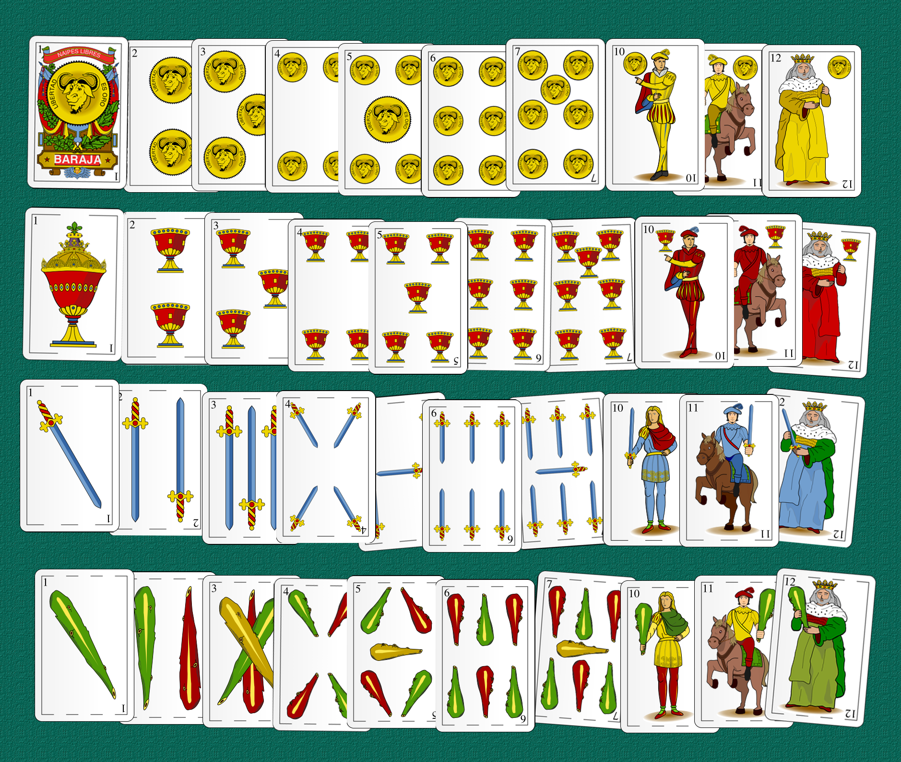
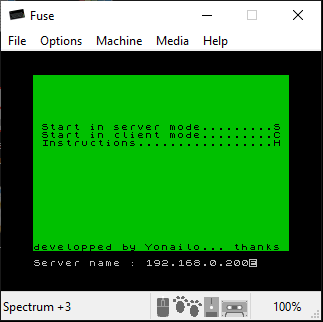
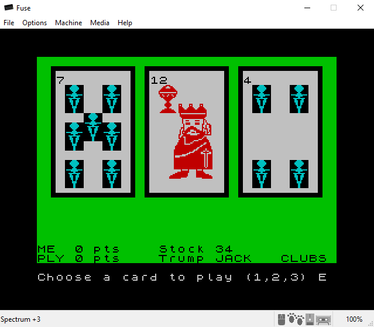
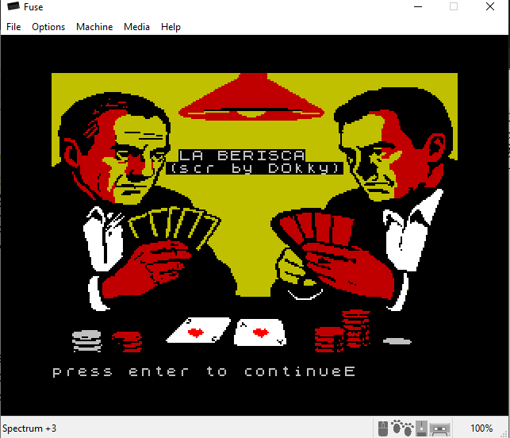
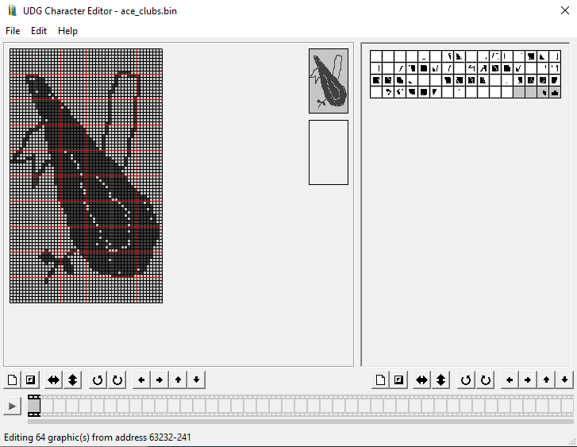

# spectrum-brisca

[The "Brisca", also known as "Berisca"](https://en.wikipedia.org/wiki/Brisca) is a popular Spanish card game played by two teams of two with a 40-card Spanish-suited pack.

This brisca game implementation for the ZX Spectrum is a simplified 1-vs-1 networking version of the original "Brisca" card's game, as it is usually played in the north regions of Spain. 

<div style="display: flex; gap: 20px">


</div>
<br/>

# Table of contents

* [Brisca rules](#brisca-rules)
* [Repository file structure](#repository-file-structure)
* [Development](#development)
* [How to run](#how-to-run)
* [Special thanks](#special-thanks)

# Brisca rules

There are 4 suits : "coins", "coups", "swords" and "clubs".

The cards from the trump's suit always beat all of the others, however high they may be.

To win, the player must earn as many points as posible. The highest card of each suit are:

* Ace : 11 points
* Three : 10 points
* King : 4 points
* Knight : 3 points
* Jack : 2 points

All other cards account for zéro points. The winner of the last round is the first to play the next one. If the second player does not throw a card of the same suit nor a triump, the first player wins the round.

Note that playing the highest card is not mandatory, neither playing the same suit.

The game ends when there are no more cards in the stock and all hand's cards have been played. A draw can be achieved with 60 points only.

# Repository file structure

The repository's files are :

```
┣ 📁 assets  : binary files for the fonts
┃ ┣ 🗒 ace_clubs.bin
┃ ┣ 🗒 ace_coins.bin
┃ ┣ 🗒 ace_coups.bin
┃ ┣ 🗒 ace_swords.bin
┃ ┣ 🗒 fonts.bas
┃ ┣ 🗒 generic_10.bin
┃ ┣ 🗒 generic_11.bin
┃ ┣ 🗒 generic_12.bin
┃ ┣ 🗒 screen-presentation-by-DOkky.src
┣ 📁 images  : images for the README.md
┃ ┣ 🗒 ...
┣ 📁 spectranet : prebuilt images & fuse roms
┃ ┣ 📁 fuse
┃ ┃ ┣ 🗒 roms.zip
┃ ┣ 📁 spectranet.tuxe.es : TNFS server files
┃ ┃ ┣ 🗒 boot.zx : autoload file
┃ ┃ ┣ 🗒 brisca.sna : snapshot launched by boot.zx
┣ 🗒 brisca.bas : BASIC code
┣ 🗒 brisca.szx : snapshot 
┣ 🗒 brisca.tap : TAP file
```

# Development

The game has been developped with [FUSE](https://fuse-emulator.sourceforge.net/) for the spectranet integration and with [BasinC](https://arda.kisafilm.org/blog/?p=1480&lang=en) for everything else (fonts creation & cards drawing).



Initially I was thinking in making a computer vs player game, but after discovering the exciting world of [spectranet](https://www.bytedelight.com/wp-content/uploads/2023/03/Spectranet-Manual.pdf) I chose to create [a networked game](https://spectranet.bytedelight.com/).

The spectranet hardware allows up to 4 sockets, that includes the listening socket so theoretically only up to 3 clients could be connected. If you have a filesystem already mounted, that also removes one of the available sockets. In order to make things easier, only 2 clients per server are supported.

The [loading screen](assets/screen-presentation-by-D0kky.scr) has been developped by DOk^RA :



From a BASIC break, in order to run in client mode you can issue `RUN 9998`. `RUN 9999` is for running in server mode. The server code starts at line 2000, and the client code at line 3000.


## Custom fonts & UDGs

Some of the cards are drawn using UDGs and there are 7 cards that are drawn using a "custom font". You can point the CHARS system variable to a reserved memory space to replace the original 255 spectrum caracters set with your own. This allows to fast drawing some of the cards :

* 4 Aces (one for each suit)
* Generic Jack, Knight & King (their suit is added as an UDG)

The available room for each card is a rectagle of 6x10 caracters. In order to simplify the handling of the CHARS system var, each custom font has been padded with 0s up to 64 bytes.

At the beginning of the code, the espace needed for the fonts & UDGs is reserved with CLEAR :

```
10 CLEAR 61695
20 REM Brisca
30 REM Fonts reserved memory
40 REM 65535-(21*8)-7*(64*8) = 61789
50 REM Rounded to the closet 256 multiple
```

So starting at memory position 61696, in groups of 64 bytes (6x10 + 4 bytes of padding), you will find "ace coins", "ace coups", "ace swords", "ace clubs", "generic jack, "generic knight" and "generic king".

All the drawings have been created with BasinC UDG Character Editor :



For the rest of the cards, UDGs are used for drawing. Each suit UDG uses a rectangle of 2x3 chars, so there is not enough room for having the 4 suits (4x2x3 = 24 and there are only 21 UDGs).

In order to cope with this limitation, I could have used some of the font's padding for the missing suit, but to simplify I have used the coups suit as a coin suit removing the bottom line (so the coin's suit is made of a grid of 2x2 chars instead of 2x3 as the others). For the generic cards fonts (jacks, knights and kings), the corresponding suit is added as an UDG after drawing them.

## Data structures and coding

I have tried to document the expected parameters of every GO SUB call. The main data structures are :

```
339 DIM c(40,4): DIM u$(40,6): DIM n$(40,13)
```

The c integer array contains for each card its INK & PAPER colors, its drawing subroutine and its custom font memory address (when applicable). The u string array has a reference for drawing the 2x3 grid suit. Finally, the n string array contains the english name of every card.

The cards are identified with numeric IDs
* [1..10] : coin suit (1 -> Ace, 8 -> Jack, 9 -> Knight, 10 -> King)
* [11..20] : coups suit (11 -> Ace, 18 -> Jack, 19 -> Knight, 20 -> King)
* [21..30] : coups suit (21 -> Ace, 28 -> Jack, 29 -> Knight, 30 -> King)
* [31..40] : coups suit (31 -> Ace, 38 -> Jack, 39 -> Knight, 40 -> King)

In order to improve the randomness of the cards' stock shuffling, there is a `RANDOMIZE 0` just before entering into server mode. 

The server orchestrates both clients. It communicates what the other end has played and it computes the winner at each round. It keeps the points of each party and decides who will play first next. At the end of the game it will send to each party who the winner is, the loser or if there is draw.

## Networking


The game is made to be played with spectranet's rom. At this moment only FUSE supports spectranet's rom. The [procedure described here](https://sourceforge.net/p/fuse-emulator/wiki/Spectranet%20Emulation/) in order to install the spectranet firmware with FUSE does not work with the FUSE 1.6.0. You will find [here](spectranet/spectranet_setIPandReset.szx) a prebuilt snapshot that allows you to configure your IP address and your gateway (NOTE that the FUSE implementation does not support DHCP yet.). You might need to install the [FUSE roms](spectranet/fuse/roms.zip) available within this repository too.

### Sockets

In server mode, the game listens on port 2000. It allows only 2 clients, which are identified with channels #6 and #7 respectively.

The clients can specify the remote DNS name or IP address in order to connect to the server.

The game starts when at least 2 clients are connected. Both the clients and the server read data using a [control socket](https://spectrum.alioth.net/doc/index.php/Guide) for not blocking waiting for input.

### Message's exchange

The game is managed by the server, it is the server which shuffles the stock of cards and who distributes them to each client. The server computes the winner at each round, decides who plays next and at the end signals the winner and loser.

The communication is made of multiple commandes exchanged between the parties :

* (s>c) `CARD` + (s>c) `<cardid>`
* (s>c) `TRUMP` + (s>c) `<trumpid>`
* (s>c) `PLAY`
* (s>c) `PLAYED` + (s>c) `<cardplayed>`
* (s>c) `POINTS P1` / `POINTS P2` + (s>c) `<points>`
* (s>c) `WIN` / `LOSE` / `DRAW`

>(s>c) means "the server sends to the client"

As it is not easy to manipulate strings with the ZX Spectrum, some messages are made of two writes to the communication channel, the first one is the command (i.e. "CARD") and the second write is a value.

The communication from client to server only happens to send to the server the card that the user has played, only after receiving a "PLAY" command from the server.

### Issues

The current FUSE release (1.6.0) has a bug accepting clients connections. The "conn" socket message on the listening socket is never received, so for the clients connections to be accepted I need to send something which is  discarded afterwards by the server.

There is a bug in my code, if the client connects and disconnects inmediately, it is not handled correctly. I should check for "disconn" message on the listening socket (#4) and if that happens I should %close it and re-listen again.

The server polls the control socket for client's messages. A timeout has been implemented to not block the server indefinitely. If a client takes more than 30 seconds to send something, the server will abort both connections and it will start over, resetting the game. The 30 seconds begin to count at the end of the round, so even if you don't press ENTER to continue to the next round, the countdown is running, and you will have to spend some time waiting for the drawing of the new card, so maybe this timeout should be increased. In any case you are warned : do not hesitate for long to play, otherwise the server will reset itself :)


# How to run

The game can be run in client or server mode. The server mode will start listening for connections at port 2000. The port is not configurable.

You can not play against the computer, there must be two clients and a server.

I have configured a [TNFS server](https://spectrum.alioth.net/doc/index.php/TNFS_server) from where you can spawn the game directly. The following list describes the easiest way to run the game :

1. Open [this file](spectranet/spectranet_setIPandReset.szx) with FUSE.
2. Configure your local IP address, network mask and gateway.
3. Connect to my spectranet TNFS server and load the boot program :
```
%mount 0,"spectranet.tuxe.es"
%load ""
```
4. Launch the Brisca game pressing "S". The booting code will launch [this SNA file](spectranet/spectranet.tuxe.es/brisca.sna).

5. The program will ask you to start the game in server mode (listening for clients connections) or in client mode (to play as in a two player's game).

6. In server mode, the program will listen at its local IP address and port 2000.

7. In client mode, the program will let you specify the IP address of the server, the port is assumed to be 2000.

You can run three instances of FUSE like this, one running as a server and the other 2 as clients.

If the client(s) and server are located in different computers, please make sure that you can join the server IP address at port 2000. 

>The instance running the server will PRINT some debugging commands during the game, like the card's stock, the number of played rounds and the variable `turn` which signals who plays first.

# Special thanks

This work would have not been possible without the help of a lot of people. Foremost and first, thanks to `@bkg2k` from the [Recalbox discord server](https://discord.gg/recalbox) for repairing my original ZX Spectrum 48k+ computer.

I can not stop here without citing the great and welcomed people from the [ZX Spectrum discord](https://discord.gg/Sj4ZAjKC). They have saved my life multiple times when I was blocked, they have always tried to answer my questions (in a very bad english) even when they were obvious or stupid. They have told me to read-the-fucking-manual in a very kindly way, and I know they are right.

We all laugh together because we all love our childhood's machine, and that's all that counts for us.

Rest in peace Sir. Sinclair, I thank you too.
